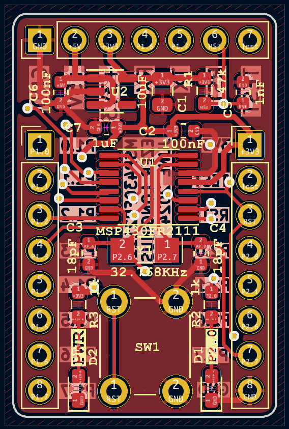
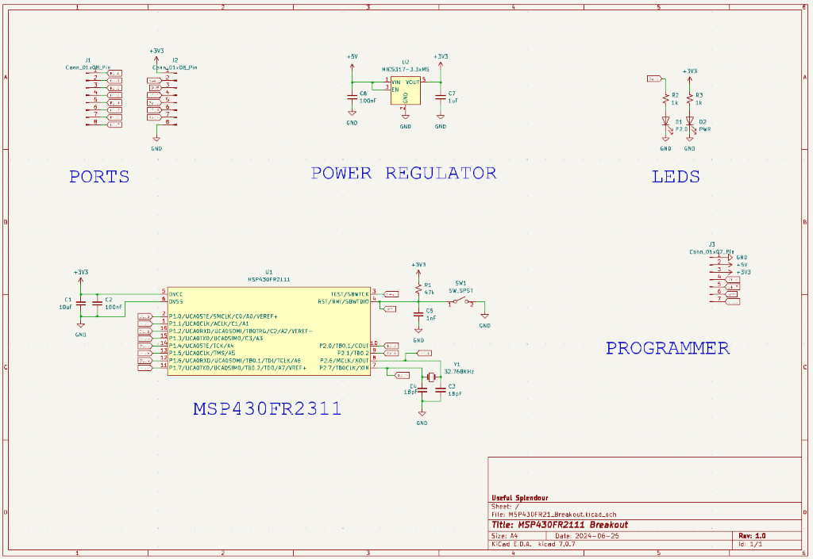

# MSP430FR21_Breakout
Basic breakout for the MSP430FR2111 chip

This board is a simple breakout using the [MSP430FR2111](www.ti.com/lit/ds/symlink/msp430fr2111.pdf) chip.  All the pins of the chip are broken out into separate headers.  There is an additional header on the top of the board to allow for plugging directly into the MSP-EXP430FR2311 evaluation board to upload code.  The breakout can accept 5V through the onboard regulator, or 3.3V directly.  There is a reset and onboard power indication LED. There is also a slot for a 32.768kHz clock and onboard LED connected directly to P2.0, for testing.  

## Purpose
I was looking to try out some development on the MSP430 series, slightly beyond the launch pads, and found a fairly [inexpensive chip](https://www.lcsc.com/product-detail/Microcontrollers-MCU-MPU-SOC_Texas-Instruments-MSP430FR2111IPW16_C1340043.html) to try to develop for.
I did make a slight error on the board that was ordered, which called out for 100nF capacitor on the reset line.  This actually needs to be 1nF, and has been fixed in the susequent gerber and design files.  Otherwise, the board basic goal has been achieved, and I'll continue to play around with the TI chip and architecture in the coming months to see what that is like.

## Schematic

## Layout

## Updates & Fixes
### Version 1
* Continue testing functionality of board and breakout
* Updated Reset capacitor or 1nF

